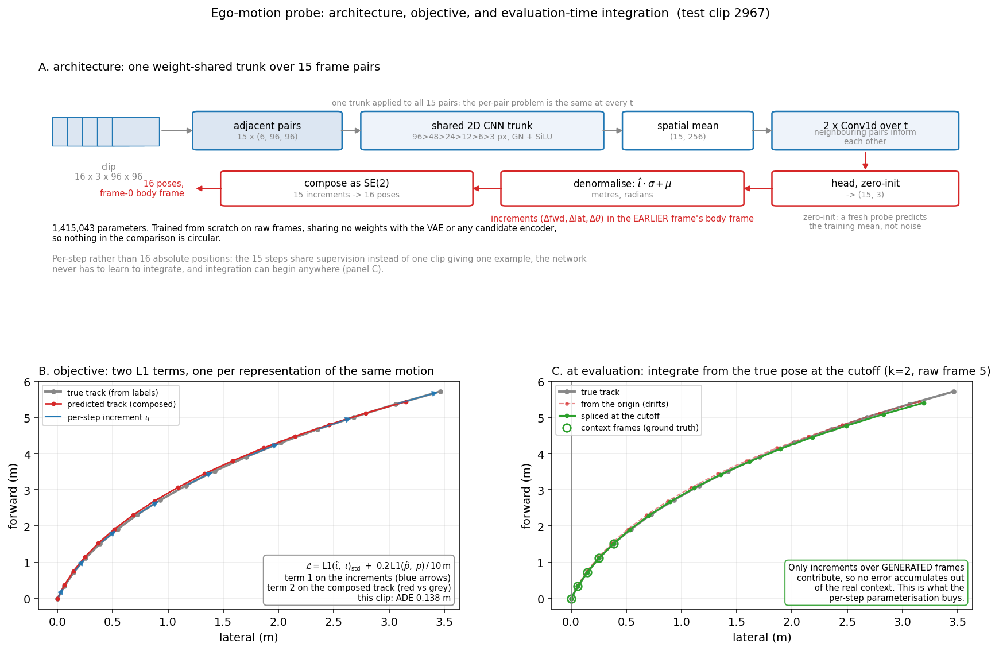
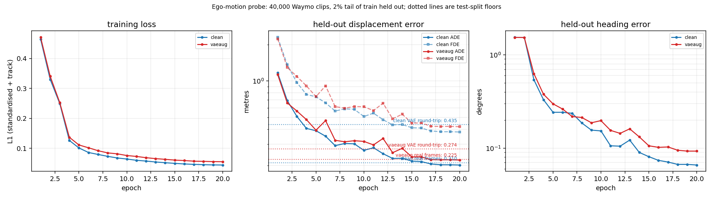
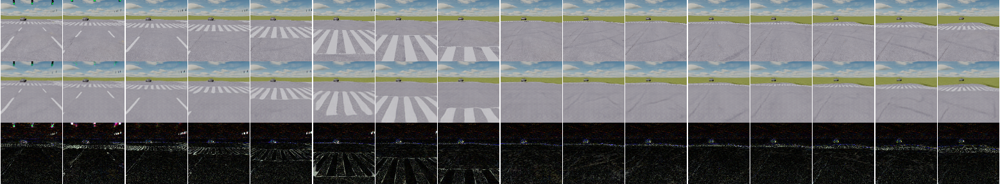

# The ego-motion probe

The trajectory axis of the stage-1 screen needs a pose track read out of generated
pixels. This is how that is done, what it costs, and the one number every trajectory
comparison has to beat to be readable.

Code: `conditioning/lib/pose_probe.py` (model), `conditioning/lib/traj_metrics.py` (the geometry),
`conditioning/scripts/train_probe.py` (training and the floors).

---

## 1. Why a supervised probe rather than DrivingGen's SLAM

DrivingGen recovers pose with SIFT + RANSAC features, UniDepthV2 depth and ORB-SLAM2,
because it scores arbitrary models on unlabelled footage. Over 16 frames at
$96\times96$ that pipeline would fall through to its own constant-velocity recovery path
almost everywhere, and the metric would then be measuring the fallback rather than the
model.

Two properties of this data make the supervised route both available and better:

- **Every clip is labelled with exact ego pose.** `annotations.npz` carries per-frame
  `ego_position` and `ego_heading` for all 44,000 clips.
- **The camera is rigidly mounted over a flat road**, at $(0, 1.2, 1.3)$ m with pitch
  $-15°$ and FOV $60°$. That fixes the ground-plane homography, so image motion maps to
  metres and **absolute metric scale is observable**. Monocular odometry normally cannot
  recover scale, which is exactly why DrivingGen needs a learned metric-depth model.

The cost of that second property: the probe is valid **only for this render
configuration** and must be retrained if the camera or resolution changes. Stage 2 moves
to DrivingGen's own pipeline, where the clip length is inside its design envelope.

**FTD is deferred to stage 2.** Its MTR `agent_polyline_encoder` windows are $H{=}10$ at
stride 10, which yields a single degenerate window for a 16-frame clip.

## 2. Parameterisation: per-step increments, composed

Panel A is schematic; **panels B and C are the trained probe on a real test clip**
(2967, a 43.7° turn, ADE 0.138 m), so the objective is shown on actual predictions
rather than a cartoon. Panel C is the one worth dwelling on: the dashed red track
integrates from the origin and drifts, while the green track begins at the true pose at
the cutoff and so measures only what the model generated.

The network predicts, for each adjacent frame pair, the increment
$(\Delta\text{fwd}, \Delta\text{lat}, \Delta\theta)$ **in the earlier frame's body
frame**, and the 15 increments are composed as SE(2) transforms.

Three reasons this beats regressing 16 absolute positions:

1. Every step is the same problem regardless of $t$, so the 15 steps share supervision
   instead of one clip giving one example.
2. The network never has to learn to integrate.
3. **Integration can start from the true pose at the conditioning cutoff**, so when
   scoring a generated clip every measured increment comes from generated frames alone
   and no error accumulates out of the real context frames.

The geometry lives in `traj_metrics.py` rather than beside the model, so it stays pure
numpy and its round trip against `to_ego_frame` is testable without torch. That test is
the load-bearing one: if composing the increments did not reproduce `to_ego_frame`, every
trajectory number would be quietly wrong in a way no training curve would reveal. It
holds to $\approx 6 \times 10^{-8}$ m, the float32 limit of the targets.

## 3. Model and training

| | |
|---|---|
| parameters | **1,415,043** |
| trunk | adjacent frames stacked as 6 channels through one weight-shared 2D CNN, $96 \to 3$ px over five strided blocks |
| temporal | two `Conv1d` layers over the 15 pairs, for noise rejection on low-texture frames |
| head | zero-initialised, so a fresh probe predicts the training mean rather than noise |
| independence | trained from scratch on raw frames, sharing no weights with the VAE or any of the four candidate representations |
| splits | fit 38,000 / held out from train 2,000 / test 4,000 |
| loss | L1 on standardised increments $+\ 0.2 \times$ L1 on the integrated track, so integration error is penalised directly |
| optimiser | AdamW, lr $3\times10^{-4}$, wd 0.01, OneCycle, batch 64, 20 epochs |

Increment statistics from the fit set, which is also why standardisation matters: mean
$(0.710, -0.00025, 0.00048)$ against std $(0.593, 0.0153, 0.0098)$. The three channels
differ by two orders of magnitude, so an unstandardised L1 would optimise forward motion
alone.

## 4. Training curves

Two runs: `clean` trains on real frames only, `vaeaug` replaces a training clip with its
VAE round-trip at $p = 0.5$. Both converge and plateau by about epoch 17, so 20 epochs is
the right budget. Held-out ADE falls $1.166 \to 0.202$ m for the clean run, a $5.7\times$
reduction, and heading error $1.536 \to 0.066$ deg.

**The dotted lines are the point of the figure.** They are the two test-split floors for
each run, and the blue pair is far apart where the red pair is close.

## 5. The two floors, and the confound they measure

Reported by `conditioning/scripts/train_probe.py` before any comparison is read.

| | clean probe | `--vae-aug` probe |
|---|---|---|
| **real frames**, ADE | 0.2105 m | 0.2247 m |
| real, FDE / heading | 0.3998 m / 0.053° | 0.4260 m / 0.078° |
| **VAE round-trip**, ADE | **0.4351 m** | **0.2739 m** |
| round-trip, FDE / heading | 0.8299 m / 0.132° | 0.5134 m / 0.112° |
| **ratio** | **2.07x** | **1.22x** |

The **real floor** caps what the whole trajectory axis can resolve: any difference
between conditions smaller than it is unreadable. For scale, mean path length over a clip
is 10.38 m, so 0.21 m is about 2% of the distance travelled.

The **round-trip floor** is the one that actually binds. The ego motion is identical to
the real clips, so all the extra error is attributable to appearance degradation alone.
If probe accuracy tracks appearance quality, then a condition that produces prettier video
earns a better trajectory score partly by being easier to read, and the trajectory axis
becomes contaminated by the visual axis. That would destroy the point of reporting two
axes.

At $2.07\times$ the clean probe had exactly that problem. Training through the
degradation costs **7% on real frames** and buys **37% on degraded ones**, taking the
gap to $1.22\times$. That is the right trade, because the degraded figure is the one
that governs.

> **Use `out/probe_vaeaug/probe.pt` for evaluation, and quote a trajectory floor of
> 0.274 m.** Generated video passes through the same decoder *plus* DiT error, so treat
> it as a lower bound rather than the exact floor.

## 6. What the VAE actually does to the frames

Three rows: real, the VAE reconstruction the augmentation substitutes, and
$|\text{difference}|$ amplified $4\times$. Five clips spanning 0.00 m to 30.18 m of
travel are in `out/vae_recon/`, at PSNR 30.98 to 35.33 dB, with real-beside-reconstruction
GIFs at 10 Hz.

At a glance the reconstruction is good and everything structural survives. The difference
row shows why the probe still degrades: **the error is not spread evenly.** It is
near-black over the road interior and bright along exactly three things — the horizon line
where road meets grass, the crosswalk stripe edges, and small distant vehicles. Over
0.1 s at $96\times96$ the apparent motion is a shift of a pixel or two, and those edges
are what carry it. The VAE preserves the *scene* and degrades the *edges*, which is the
worst available trade for reading displacement.

The reconstructions also carry a fine **checkerboard texture** on road surfaces, visible
shimmering against the moving road in the GIFs. It comes from the VAE decoder, since it
appears in a plain reconstruction with no DiT involved, and it is static in image space,
so anything reading apparent flow is pulled toward zero motion by a pattern that does not
move.

## 7. Sanity controls

| control | clean | `--vae-aug` | verdict |
|---|---|---|---|
| 16 copies of one frame, net displacement | 0.1879 m | 0.2857 m | **pass**, below the floor |
| time-reversed clip, forward sum | +24.54 m | +23.78 m | **fail**, should be about $-11.76$ m |

The static control passes: a frozen clip reads as near-zero motion, within the floor.

**The reversal control fails and always will.** Dashcam footage contains essentially no
reverse motion, so nothing in training rewards direction sensitivity and more training
strengthens the monotone "more apparent flow means more forward displacement" mapping.
The control is out of distribution by construction.

What that means for use: the probe measures forward displacement and heading accurately
on forward driving, which is all that is ever generated, and the 0.21 m real floor proves
it. But it is **not general visual odometry** and should not be described as such, and it
cannot detect a generated clip that moves the wrong way along the road.

## 8. Artefacts

| path | contents |
|---|---|
| `out/probe/probe.pt`, `probe_floors.json` | clean probe and its floors |
| `out/probe_vaeaug/probe.pt`, `probe_floors.json` | **the probe used for evaluation** |
| `out/probe_design.png` | the figure in §2: architecture, objective, splice |
| `out/probe_curve.png` | the figure in §4: training curves and both floors |
| `out/vae_recon/vae_recon_sheet.png` | five clips, three rows each, 4672x4430 |
| `out/vae_recon/clip*_real_vs_vae.gif` | real beside reconstruction, 10 Hz |
| `out/logs/probe_vaeaug.log`, `out/probe_clean.log` | full training logs, parsed by `conditioning/scripts/plot_probe_curve.py` |

Regenerate: `scripts/node_probe_design.sh` for the design figure,
`scripts/node_probe_curve.sh` for the curves, `scripts/node_vae_recon.sh` for the
reconstruction sheet.
