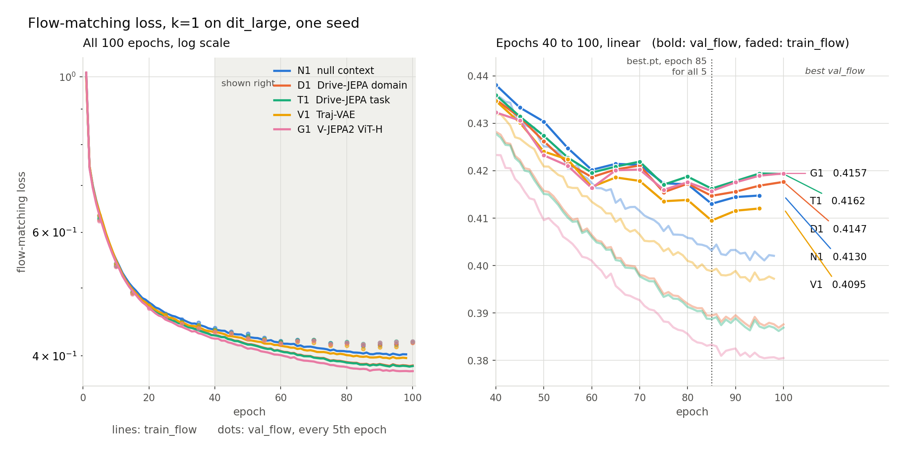
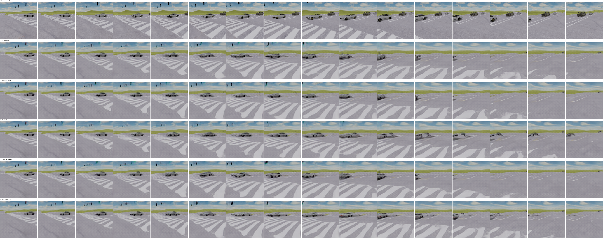

# Stage 1 at $k=1$ on dit_large: report

**Setup.** Five MiniDiTs (width 384, 8 blocks, 30.1M params for N1), trained from scratch for 100 epochs at effective batch 32, differing only in the cross-attention conditioning. At $k=1$, raw frame 0 is the only real frame and frames 1 to 15 are generated. The ViT encoders see frame 0 twice (tubelet 2) at $256 \times 256$, and the Traj-VAE sees frame 0 alone. Evaluated at `best.pt` (epoch 85 for all five) on all 4,000 test clips, seed 0, 50 Euler steps. One seed.

In every table, **bold** is the best value in its column and <u>underline</u> the second best.

## 1. Visual

| condition | tokens | FVD16 $\downarrow$ | PSNR $\uparrow$ | SSIM $\uparrow$ | LPIPS $\downarrow$ | best val flow $\downarrow$ |
|---|---|---|---|---|---|---|
| N1 null context | none | 213.36 | 25.117 | 0.7213 | 0.0948 | <u>0.4130</u> |
| D1 Drive-JEPA domain | $256 \times 1024$ | <u>208.74</u> | <u>25.248</u> | <u>0.7250</u> | <u>0.0892</u> | 0.4147 |
| T1 Drive-JEPA task | $256 \times 1024$ | 210.40 | 25.214 | 0.7240 | 0.0897 | 0.4162 |
| V1 Traj-VAE | $144 \times 16$ | 216.82 | 25.134 | 0.7227 | 0.0936 | **0.4095** |
| G1 V-JEPA2 ViT-H | $256 \times 1280$ | **208.64** | **25.259** | **0.7265** | **0.0875** | 0.4157 |

## 2. Trajectory

Probe VAE round-trip floor: 0.2739 m ADE.

| condition | ADE (m) $\downarrow$ | FDE (m) $\downarrow$ | DTW $\downarrow$ | heading (deg) $\downarrow$ | composite $\uparrow$ |
|---|---|---|---|---|---|
| N1 null context | 1.4767 | 2.9880 | 13.886 | 0.870 | 0.7100 |
| D1 Drive-JEPA domain | 1.4029 | 2.8150 | 13.068 | 0.788 | <u>0.7179</u> |
| T1 Drive-JEPA task | <u>1.3911</u> | <u>2.7895</u> | <u>12.924</u> | <u>0.782</u> | **0.7242** |
| V1 Traj-VAE | 1.4541 | 2.9443 | 13.810 | 0.868 | 0.7038 |
| G1 V-JEPA2 ViT-H | **1.3469** | **2.7003** | **12.403** | **0.779** | 0.7164 |

## 4. One context frame against two

Gain over each setting's own N. The ADE cut is relative to that N's ADE. The $k=2$ runs use the 10.1M dit_base backbone, so this compares how much each encoder adds, not absolute quality.

| condition | PSNR gain, $k=2$ $\uparrow$ | PSNR gain, $k=1$ $\uparrow$ | ADE cut %, $k=2$ $\uparrow$ | ADE cut %, $k=1$ $\uparrow$ |
|---|---|---|---|---|
| D1 Drive-JEPA domain | +0.488 | <u>+0.131</u> | 26.1 | 5.0 |
| T1 Drive-JEPA task | <u>+0.505</u> | +0.097 | <u>27.4</u> | <u>5.8</u> |
| V1 Traj-VAE | +0.078 | +0.017 | 11.2 | 1.5 |
| G1 V-JEPA2 ViT-H | **+0.616** | **+0.142** | **29.9** | **8.8** |

## 5. Findings

- **G1 is best on 8 of 9 metrics**, as at $k=2$: the generic V-JEPA2 encoder beats both driving-specific Drive-JEPA encoders on both axes. T1 is best only on the composite.
- **D1, T1 and G1 all separate from N1 across clips** on PSNR, LPIPS, ADE and DTW. The largest trajectory gain, G1's 0.130 m ADE, is below the probe's 0.2739 m floor, so under the plan's rule no condition separates on the trajectory axis.
- **T1 against D1 is a tie.** Task training over domain pretraining adds about 0.01 m of ADE and nothing visually.
- **V1 does not separate from N1** on PSNR, ADE or DTW, and has the worst FVD16. Trained on 16 context frames, the Traj-VAE has no motion to encode from a single still.
- **One frame shrinks every encoder's contribution**: the PSNR gain over N falls about fourfold and the ViTs' relative ADE cut from 26 to 30% to 5 to 9% (section 4).
- **Validation flow loss does not predict sample quality.** V1 and N1 have the lowest validation loss and the weakest evals. The ViT conditions reach the lowest training loss with a wider train to val gap (about 0.035 for G1 against 0.012 for N1), consistent with their dense tokens partly acting as a per-clip key.

## 6. Figures

Rows: GT, N1, T1, V1, D1, G1. Six clips with all five conditions are in `out/comparison_k1/`; 12 clips (GT, D1, T1, G1), spanning the 10th to 99th percentile of path length plus the five sharpest turns, are in `out/comparison_k1_DTG_12/`.

## 7. Limits

- One seed: a CI excluding 0 means the ordering holds across clips, not across training runs.
- Conditioning bandwidth differs by a factor of 114 to 142 between V1 and the ViTs, so capacity explains their lead as well as driving-specificity does. D1 against T1 is the matched comparison.
- Speed is not observable from one still, so ADE here is dominated by guessed speed.

The seed choice largely explains this, so matching turns in this sheet say little about how random the model is.

1. All six panels start from the same noise. make_comparison.py calls torch.manual_seed(0) right before sampling each condition. So every panel gets the same frame-0 latent and the same initial noise tensor. Euler sampling of the flow ODE is deterministic, which means noise and frame 0 fully fix the output. The only thing that differs between conditions is the cross-attention input, a small change on top of that shared starting point. Five panels that look alike are close to one sample shown five times, not five independent draws. N1, which gets no conditioning at all, turns the same way, which points to the shared noise and frame 0 driving the turn rather than the encoders.

2. The single frame already carries a lot of heading information. In frame 0 the crosswalk stripes run diagonally, so the ego is already partly rotated into the turn. The car ahead and the road edges also constrain where the road can go. The comparison picks "turning" clips as the sharpest heading changes over the clip, so these are clips where the turn has already started at frame 0, not clips sitting before an undecided junction.

3. The data and the loss both push toward one mode. This looks like a synthetic town with a small set of intersections repeated many times. Train and test clips likely share the same locations, so the model can learn which way traffic goes at each one. A small MiniDiT trained with flow-matching MSE on limited data also drifts toward the conditional mean. The blurring supports this: the crosswalk stripes smear together and the car melts away instead of being passed as it is in GT.

How to check: sample the same clip with about 8 seeds per condition and measure the spread of the generated trajectories with the probe, or just look at how often the turn direction flips. Also pick clips where frame 0 sits before a junction with the heading still straight, not mid-turn. The k=1 checkpoints are gone, but the k=2 ones (N, T, V, D, G) are in backup/b_ckpt.tar and would show the same effect. At k=2, though, more real frames go in as context, which makes the turn even easier to predict.