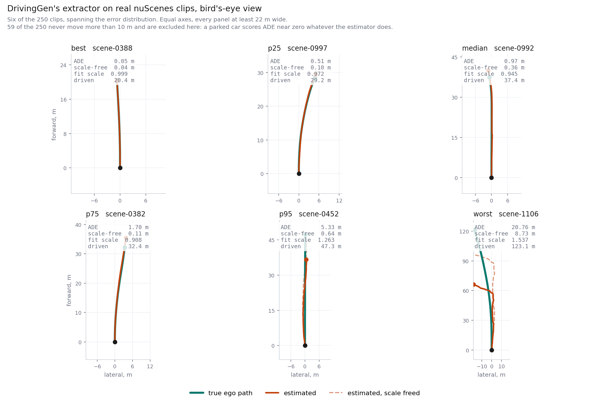
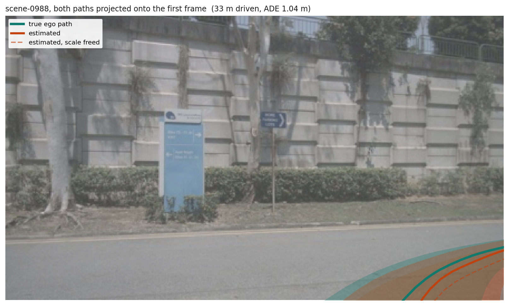

# Calibrating DrivingGen's trajectory axis on nuScenes

DrivingGen's trajectory metrics read a path out of pixels, so they carry an error of
their own before any generator is involved. This measures that error by running their
extractor on **real** nuScenes footage, where ground-truth ego pose is known exactly.
Everything below is a noise floor, not a score.

It is measured at two geometries. **DG**, $1024\times576$ over 101 frames, is
DrivingGen's own setting, so a number taken there can be read beside their published
table. **S2**, $448\times256$ over 69 frames, is the stage-2 training geometry, and its
floor is the one that binds every comparison between conditions.

Two defects in their released code account for most of the floor at both. Both are
one-line fixes, and together they cut median error by 63% at DG and 69% at S2.

Design in `STAGE2_PLAN.md` section 5. The extractor is
`drivinggen/func/extract_traj_ego_unidepth.py` plus `visual_slam/vo.py`, run unmodified
apart from accepting a frame size other than $576\times1024$, recording the `ok` flag
their driver discards, and seeding the random recovery path.

---

## 1. What was run

250 clips, one per scene of the held-out probe pool, at each geometry, with $dt = 0.1$.
nuScenes CAM_FRONT is 12 Hz and irregularly spaced, so frames are taken on a strict
10 Hz grid with the nearest real frame to each instant; ground truth is read at the
frames actually chosen, so the resampling adds no error to a displacement metric.

| | DG | S2 |
|---|---|---|
| resolution | $1024\times576$, a plain resize of $1600\times900$ | $448\times256$, from a $1575\times900$ centre crop |
| frames, duration | 101, 10.0 s | 69, 6.9 s |
| clips that move at least 10 m | 205 of 250 | 191 of 250 |
| median path length | 61.2 m | 43.2 m |

Two things are varied.

**Where the camera matrix $K$ comes from.** It is read in two places: UniDepthV2's
intrinsics argument, and the matrix used to back-project matched pixels before the PnP
solve.

| mode | $K$ into depth | $K$ into PnP |
|---|---|---|
| `predicted` | none | UniDepth's own prediction |
| `calibrated_slam` | none | real, from `calibrated_sensor.json` |
| `calibrated_both` | real | real |

`predicted` is their code as released. `calibrated_slam` is their own commented-out
branch at lines 340 to 344, switched back on.

**Which pixels may produce features.** `drive_roi_mask(h, w, keep=0.5)` returns
`m[0 : h*keep]`, the **top** half of the frame, so the road surface never yields a
feature. `full` removes that vertical cut and keeps their 3% side inset.

---

## 2. What each metric is

Every metric below is computed per clip by DrivingGen's own `trajs` package, then
summarised over the moving clips. Alignment first: their `slam_align_to_gt_fix_origin`
pins both paths at the origin, fits the rotation that best overlays them, and **holds
scale at 1**, so nothing is ever rescaled to the reference. Both paths are then
Savitzky-Golay smoothed over 0.4 s.

**Error against ground truth**, lower is better.

| | |
|---|---|
| **ADE** | Average Displacement Error. Mean over the clip's frames of $\lVert \hat{p}_t - p_t \rVert$, in metres. The primary number. Its mean across clips is set by the tail, so read the median; p95 says how bad a bad clip is |
| % > 10 m | share of clips whose ADE exceeds 10 m. Larger than a lane change, so this is a reconstruction-failed count rather than an accuracy figure |
| **scale-free ADE** | the same metric with the alignment allowed to fit a per-clip scale. The difference from ADE is the part of the error that is metric scale rather than path shape |
| **FDE** | Final Displacement Error, $\lVert \hat{p}_{T} - p_{T} \rVert$. Position error at the last frame only, so it reads accumulated drift |
| **DTW** | dynamic time warping cost, L2, unnormalised. Measures shape: a shift along the direction of travel is absorbed by the warp, so a path that is right but slow scores well here and badly on ADE |
| **Hausdorff** | symmetric Hausdorff distance. The largest gap from any point on one path to the nearest point on the other, so it is worst-case rather than average |
| **SR@3m** | success rate, the share of clips with FDE under 3 m. Binary per clip, so only its mean means anything |
| **heading** | mean absolute difference between estimated and true heading relative to frame 0, in degrees. **Not one of their metrics**; it is derived here from the pose chain their extractor saves |
| **FTD** | Fréchet Trajectory Distance. Each clip is encoded by MTR's `agent_polyline_encoder` over 11-frame windows at stride 10, the window features averaged into one 256-d vector, then a Fréchet distance between the estimated and real sets. DG gives 10 windows per clip and S2 gives 6. A set-level metric, so there is no per-clip value and no bootstrap |

**Reference-free**, computed on the estimated path alone, higher is better, range 0 to 1.
Their `get_traj_quality` averages the first three into one composite.

| | |
|---|---|
| **comfort** | geometric mean of per-metre peak jerk, acceleration and yaw rate, each mapped through $1/(1+x)$ |
| **curvature RMS** | RMS path curvature, mapped the same way |
| **speed score** | log-linear map of mean speed, rewarding motion over crawling |
| **composite** | the mean of those three, which is their single quality number |
| **dynamic consistency** | $e^{-W_1(v)} \cdot e^{-W_1(a)}$, the 1-D Wasserstein distance between the estimated and true speed and acceleration distributions. This one does use ground truth |
| **trajectory consistency** | $\tfrac{1}{2}(e^{-\sigma_v/\mu_v} + e^{-\sigma_a/\mu_a})$, smoothness of the estimate alone |

**Diagnostics**, added here because their code computes them and discards them.

| | |
|---|---|
| **scale** | median factor a per-clip scale fit would apply. 1.000 means no systematic length bias; below 1 means the estimate is systematically short |
| **fallback** | share of frame pairs whose pose estimate failed `is_pose_valid` and was replaced by the previous step length at a uniformly random yaw within $\pm 90°$ |

Clips that never travel 10 m are excluded throughout. A parked car scores about 0.1 m
whatever the estimator does, and that is 45 of the 250 clips at DG and 59 at S2, the
difference being the shorter window.

---

## 3. Results

Ground truth is the ego origin; the camera optical centre gives the same numbers to
within 0.02 m, so the sensor extrinsic does not matter at this error scale.

**S2, $448\times256$ over 69 frames.** The floor the experiment is read against.

| configuration | ADE median | ADE mean | p95 | > 10 m | scale-free ADE | SR@3m | scale | fallback |
|---|---|---|---|---|---|---|---|---|
| `top` + `predicted` **(as published)** | 3.092 | 4.720 | 15.14 | 9% | 0.676 | 0.194 | 0.877 | 1.1% |
| `top` + `calibrated_slam` | 3.144 | 4.828 | 16.46 | 10% | 0.628 | 0.199 | 0.873 | 1.1% |
| `top` + `calibrated_both` | 1.869 | 3.725 | 16.52 | 7% | 0.532 | 0.482 | 0.971 | 0.9% |
| `full` + `predicted` | 2.633 | 3.093 | 7.56 | 2% | 0.435 | 0.298 | 0.884 | 0.1% |
| `full` + `calibrated_both` **(repaired)** | **0.967** | **1.471** | **4.94** | **1%** | **0.285** | **0.743** | **0.988** | **0.1%** |

**DG, $1024\times576$ over 101 frames.** Their own setting.

| configuration | ADE median | ADE mean | p95 | > 10 m | scale-free ADE | SR@3m | scale | fallback |
|---|---|---|---|---|---|---|---|---|
| `top` + `predicted` **(as published)** | 3.065 | 5.159 | 17.47 | 12% | 0.784 | 0.298 | 0.933 | 1.1% |
| `top` + `calibrated_slam` | 2.989 | 5.133 | 18.77 | 13% | 0.765 | 0.288 | 0.932 | 1.1% |
| `top` + `calibrated_both` | 2.626 | 5.263 | 20.44 | 12% | 0.760 | 0.420 | 1.001 | 0.9% |
| `full` + `predicted` | 1.899 | 2.357 | 6.02 | **0%** | 0.390 | 0.420 | 0.934 | 0.1% |
| `full` + `calibrated_both` **(repaired)** | **1.129** | **1.772** | **5.12** | 2% | **0.371** | **0.668** | **1.001** | **0.1%** |

Over all 250 clips including the stationary ones, the published configuration gives mean
ADE 4.105 at S2 and 4.279 at DG, and the repaired one 1.175 and 1.478.

### Which fix does the work

Median paired difference against the published configuration, over the moving clips.

| change | S2 | DG |
|---|---|---|
| whole frame alone | $-0.175$ m, better on 53% | $-0.773$ m, better on 68% |
| real intrinsics alone | $-0.783$ m, better on 69% | $-0.408$ m, better on 60% |
| real intrinsics in the SLAM only | $+0.010$ m, better on 49% | $+0.003$ m, better on 49% |
| **both** | $\mathbf{-2.176}$ **m, better on 88%** | $\mathbf{-1.662}$ **m, better on 86%** |

### Every trajectory metric, at S2

Means over the 191 moving clips. Heading is in degrees, ADE / FDE / Hausdorff in metres,
DTW unitless.

| configuration | ADE ↓ | FDE ↓ | DTW ↓ | Hausdorff ↓ | SR@3m ↑ | heading ↓ | FTD ↓ |
|---|---|---|---|---|---|---|---|
| `top` + `predicted` **(as published)** | 4.720 | 9.376 | 179.0 | 9.528 | 0.194 | 21.20 | 32.45 |
| `top` + `calibrated_slam` | 4.828 | 9.601 | 189.9 | 9.481 | 0.199 | 18.69 | 33.52 |
| `top` + `calibrated_both` | 3.725 | 7.378 | 148.3 | 7.375 | 0.482 | 19.01 | 32.56 |
| `full` + `predicted` | 3.093 | 6.157 | 73.7 | 6.123 | 0.298 | **15.09** | **1.26** |
| `full` + `calibrated_both` **(repaired)** | **1.471** | **2.964** | **40.6** | **2.970** | **0.743** | 16.32 | 1.32 |

Medians of the same, where they differ usefully:

| configuration | ADE | FDE | DTW | Hausdorff | heading |
|---|---|---|---|---|---|
| `top` + `predicted` | 3.092 | 5.782 | 74.6 | 5.782 | 7.95 |
| `full` + `predicted` | 2.633 | 4.866 | 46.8 | 4.866 | **6.09** |
| `full` + `calibrated_both` | **0.967** | **1.730** | **24.0** | **1.730** | 6.49 |

Reference-free quality, means over moving clips:

| configuration | comfort ↑ | curvature RMS ↑ | speed ↑ | composite ↑ | dyn. consistency ↑ | traj. consistency ↑ |
|---|---|---|---|---|---|---|
| `top` + `predicted` | 0.519 | 0.686 | 0.754 | 0.653 | 0.282 | 0.463 |
| `top` + `calibrated_slam` | 0.518 | 0.689 | **0.759** | 0.655 | 0.278 | 0.460 |
| `top` + `calibrated_both` | 0.522 | 0.687 | 0.723 | 0.644 | 0.415 | 0.471 |
| `full` + `predicted` | **0.553** | **0.870** | 0.742 | **0.722** | 0.351 | 0.506 |
| `full` + `calibrated_both` | **0.553** | 0.855 | 0.706 | 0.705 | **0.600** | **0.508** |

### FTD, and the sample-size floor beneath it

A Fréchet distance between two finite samples of the *same* distribution is not zero, so
the real trajectories were split into disjoint halves and scored against each other, 20
random splits per size. That is the floor below which no FTD difference means anything.

| clips per side | S2 | DG |
|---|---|---|
| 25 | 3.802 | 2.993 |
| 50 | 1.873 | 1.540 |
| 75 | 1.194 | 1.148 |

Both fit $\mathrm{FTD} \approx c/n$, with $c \approx 93$ at S2 and $c \approx 80$ at DG,
so at the clip counts used above the floor is **0.49** and **0.39**. Those are the
numbers the measurements are taken against.

---

## 4. What the error looks like

Repaired, `full` + `calibrated_both`, at S2, six percentile slots:

Both paths projected back onto the road they describe, at vehicle track width.

---

## 5. Reading the numbers

**Both defects are real at both geometries, and which one dominates swaps between
them.** At DG the feature mask carries the median and the intrinsics carry little; at S2
it is the other way round. Together they behave the same way at both: better on 86 to
88% of clips, and the combined effect is larger than the two separate effects added,
so they are not independent.

**The mask owns the tail, everywhere.** Keeping the whole frame instead of the top half
takes S2's p95 from 15.1 m to 7.6 m, the share of clips worse than 10 m ADE from 9% to
2%, and the fallback rate from 1.1% to 0.1%; at DG the same change takes p95 from 17.5 m
to 6.0 m and the 12% tail to zero. Those were not hard scenes. They were scenes where
the top half happened to contain nothing usable, and the whole catastrophic population
was an artifact of one slice index. Its effect on the S2 *median* is only 0.18 m, which
is why the mask looks small there and is not.

**Why it matters so much.** Points reaching the PnP solve are what the accuracy tracks.
At S2 the best quartile of clips supplies 235 points per frame pair and the worst 89;
repaired, 383 against 198. The top half is sky and distant facades, which carry little
parallax and are then discarded by the 80 m depth threshold, while the near road surface
that does carry parallax is thrown away before matching begins. And
**`solvePnPRansac` needs only 6 points**, so a clip reconstructed from 20 noisy points
returns a pose, passes `is_pose_valid`, and reports `ok` every frame. That is why the
fallback rate stays near 1% while trajectories are off by more than the distance driven,
and why the point count, not the `ok` flag, is the quality signal worth logging.

**Intrinsics are a depth-network problem, and it grows as the frame shrinks.**
`calibrated_slam` is a null result at both geometries: median delta $+0.010$ m at S2 and
$+0.003$ m at DG, better on 49% of clips, a coin flip. Real $K$ in UniDepth as well moves
the median fitted scale from 0.877 to 0.971 at S2 and from 0.933 to 1.001 at DG. The
systematic shortening is 12% at $448\times256$ against 7% at $1024\times576$, and that
growth is the whole reason the two fixes trade places: on `scene-0330` UniDepth returns
$f_x = 890.1$ against a true $801.8$ at DG, an 11.0% overestimate that drifts $\pm 15$ px
across a camera that never moved, with $f_x \neq f_y$ on a sensor calibrated to
$f_x = f_y$, and less resolution gives it less to work from.

**Most of the remaining error is still length, not shape.** Even repaired, freeing
per-clip scale drops the S2 median from 0.967 m to 0.285 m, and the DG median from
1.129 m to 0.371 m. Monocular depth is the only source of metric scale and that is where
the residual sits.

**Read the median, not the mean.** The published configuration's mean is set by its
tail; the repaired one is not, which is why mean and median converge as the mask is
fixed.

**What predicts a bad clip changes with the geometry too.** At DG, PnP point count and
match count correlate $-0.65$ and $-0.66$ against log ADE and nothing else comes close.
At S2 the ordering is how fast the car was going, $+0.52$ for peak speed and $+0.49$ for
mean speed and the same for distance driven, then the fallback rate at $+0.47$, then
match and point counts at $-0.41$ and $-0.39$, then frame brightness at $-0.35$. How
much the car turned predicts nothing at either, $-0.03$ and $-0.04$. A short window at
speed is what this pipeline finds hard.

**FTD is the most sensitive metric here and the most fragile.** At S2 it separates the
broken mask from the repaired one by a factor of 25, far more sharply than ADE's factor
of 3.2, because a handful of wildly wrong trajectories move a distribution's covariance
more than they move a median. But once the mask is fixed, S2 lands at 1.26 and 1.32
against a sampling floor of 0.49, so the repaired extractor's trajectory distribution is
within about two to three times noise of the real one. Two consequences. FTD is a good
detector of gross failure and a poor discriminator between working configurations. And
its floor scales as $1/n$, so any FTD reported without its clip count is uninterpretable:
at 25 clips the S2 floor alone is 3.80, which exceeds the entire repaired measurement.

**Fixing the scale makes FTD slightly worse in both mask settings**, 1.26 to 1.32 at S2
and 0.54 to 0.99 at DG, while ADE improves. The encoder reads speed and acceleration, so
correcting the systematic length bias shifts those statistics. The two metrics measure
different things and neither alone should decide a configuration.

---

## 6. What this settles

1. **Run the extractor with the whole frame and real intrinsics.** Two lines, and the
   floor at the training geometry drops from 3.09 m to 0.97 m median. Neither change
   touches the algorithm.
2. **The floor that binds a five-condition comparison** is **0.97 m** median ADE at the
   stage-2 geometry, or **0.29 m** if the comparison aligns with scale. A gap smaller
   than that is not readable by this instrument. The corresponding DG figures are 1.13 m
   and 0.37 m.
3. **The two floors are not comparable as numbers.** S2 clips are 6.9 s and DG clips
   10.0 s, with median path lengths of 43 m against 61 m, so a smaller ADE at S2 is
   partly just a shorter path. What transfers between them is the ranking of
   configurations and the size of the repair, not the metres.
4. **Report the moving subset.** A quarter of the S2 clips are effectively parked, 59 of
   250 against 45 at DG, so an all-clip figure partly measures how many stationary scenes
   the set happens to contain and how long the window is.
5. **Log PnP points per frame pair beside ADE.** It predicts failure where the `ok` flag
   does not, and the counts at $448\times256$ run roughly half those at $1024\times576$.
6. **Never report FTD without its clip count.** Its sampling floor goes as $c/n$, so at
   25 clips the S2 floor alone is 3.80 and at 191 it is 0.49. Use it as a detector of
   gross failure, not as a discriminator between conditions that already work.
7. **A caution about the published benchmark.** As released, the extractor misses by a
   median of 3.07 m on perfect video at their own geometry, with 12% of clips beyond
   10 m. Differences smaller than that between entries in their table of 14 models are
   not distinguishable, and the tail is not evenly distributed across scene types, so it
   is not obviously a wash.
8. **The supervised ego-motion probe is still worth having.** Stage 1's probe floor was
   0.274 m on VAE round-trips, below even the repaired scale-free floor, and the two fail
   differently: this pipeline's weakness is absolute scale, which the probe learns
   directly from labelled pose.

---

## 7. What this does not cover

Real video only. Generated video will trigger the recovery path more often, and the
concern that a condition whose output cannot be reconstructed is scored by the fallback
rather than penalised remains untested until there is generated video to test it on.

Video metrics are not included. That is the second half of the suite.

---

## 8. Where things are

On the node, under `/root/cond-drivejepa-exp/`:

| path | contents |
|---|---|
| `dg_eval/lib/` | `nusc_index.py`, `clips.py` (both geometries), `extract.py`, `score.py` |
| `dg_eval/scripts/dg_*.py` | build, extract, score, summary, analyse, table, ftd, diagnose, roi test, plot |
| `scripts/node_dg_run_s2.sh` | the five S2 configurations, detached |
| `out/dg_calibration/` | `report_{dg,full_dg,stage2,full_stage2}.json`, `summary_{dg,stage2}.json`, `ftd_stage2.json`, per-clip `.npz`, figures |

Under `/root/dg/`: `clips/{dg,stage2}/` the built clips, `traj/{dg,stage2}/{mode}/` and
`traj_roi/full_{dg,stage2}/{mode}/` 250 `.npz` each, `ckpt/` UniDepthV2 and YOLOv10-X,
`viz/` the single-clip walkthrough and the exported 3D geometry.

Archived to `volume://vessl-storage/yethu-drive/results/`, since `/root` does not
survive a terminate.
